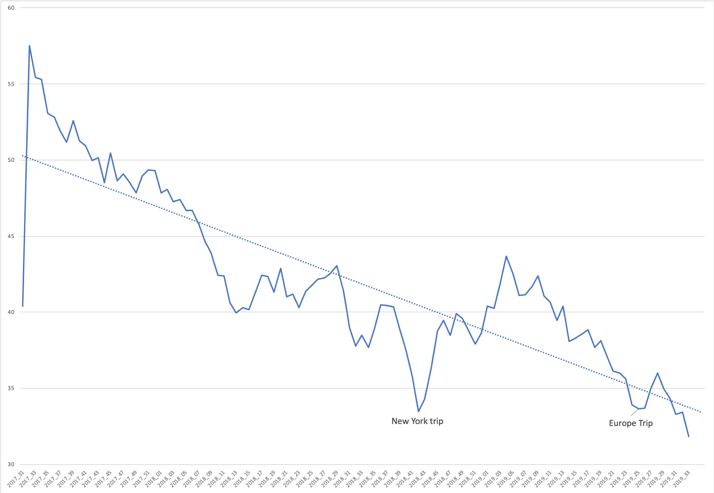
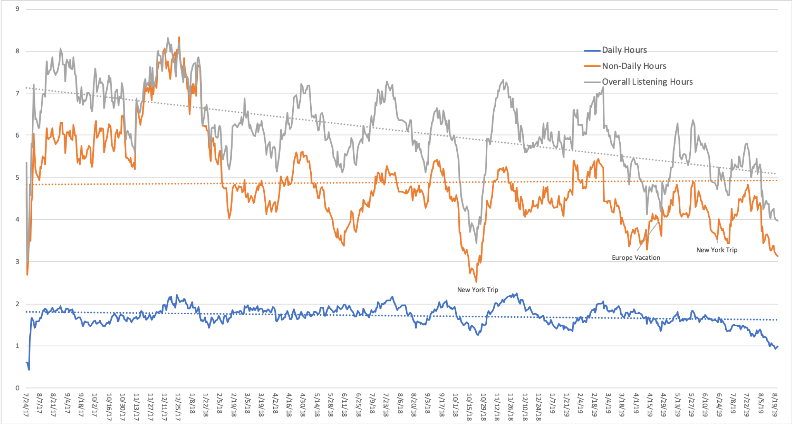

## Podcast Analysis
A query into my podcast listening habits
### Introduction

Hi, I'm Eugene and I'm trying to be a good, efficient consumer. I'm interested in design and the optimization of joy in quotidian experiences. As an individual that more often than not feels like a walking brain, podcasts are a relatively portable medium to main at least a surface-level grasp on a wide variety of topics, including design, technology, politics, and global news.

They're a medium that is new for many, but for me, as an undergraduate at Miami University, they were a valuable view into the world. For a long time, I solely consumed the BBC World News podcast. It provided two daily 30-minute podcasts, one at the start, and the other at the end of the day, hat would get me out of the US Midwest, at least mentally. 

I was not sophisticated enough at the time to record that listening data so those are lost to history, but you can trust me that as I began taking more liberal arts courses my tastes in podcasts grew. By the end of my first four years at Miami, my subscriptions had grown to encompass urbanism, design, history, and statistics. Notably, [Colin Marshal's "Notebook on Cities and Culture"](http://blog.colinmarshall.org) was especially impactful; it introduced me to people like Andrew Tuck of the Monocle Magazine. A design course Debbie Millmann a designer and long-time host of ["Design Matters,"](https://www.designmattersmedia.com/designmatters) still one of my favorite shows week over week that has grown to include all sorts of creatives.

In November 2016, like many people, I was forced to consider what media I was consuming, and how much of it. What was the utility of all of this information? Were certain ideas reinforcing others to the detriment of a healthy world view? How many hours of listening was too many? So, at that time, as a "data professional" I wanted to see if I could measure that. I created a system that would extract all of my listening for the previous day clean it up, and store it into a text file for later use. Leveraging Apple's built-in scheduling, and AppleScript, this was pretty easy to do.

### Methodology

The [Pull_Audio.py](https://github.com/BEugeneSmith/PodcastAnalysis2017/tree/master/scripts) script does this, using bash as a wrapper on AppleScript. From this process I've accumulated 561 data files for music listening, and 884 files for podcast listening, not all used in this analysis. The automated process ran every morning at 5 am, and did the following:

0) Refreshed iTunes feed  
1) Synced with my phone  
2) Extracted listening data  
3) Generated records of listening for the previous day  

Working with the data generated by 3) above, I created a [library](https://github.com/BEugeneSmith/PodcastAnalysis2017/tree/master/Analysis) to aggregate these relatively lightweight files and moved them into excel for manipulation. I have also built versions of some of these aggregation in the data visualization tool [D3.js](https://d3js.org), but for the purpose of richness and flexibility I have chosen to generate them with Excel for ease of annotation. 

#### Issues
My primary computer running the script had to be open and plugged in for automatic execution, so as much as I would have liked to eliminate all digital screens from my apartment at a certain time of night, it did not allow for a hands-off execution of this task. Additionally, if I were on vacation I had to manually intervene to maintain continuity of data. 

On occasion, the duration for a given song or podcast would render 'missing value' in a numeric field or have a non-UTF-8 compliant character in a text field, so I created a mapping file that would fill in the average numeric value for a field, or flag the given record for manual clean up within the iTunes interface. 

Due to water accident, I was without a machine for a couple of months mid-2017, so the analysis starts on July 24, 2017 and goes to August 21, 2019. 

### Results
Of the 759 dates used, 105 of them had no file, which indicates that no podcasts were consumed. Over time, consumption of podcasts on a non-daily frequency reduced from almost 8 hours in late 2017 to hovering between 5 and 6 hours in July 2019; hours for daily podcasts remained consistently between 1.5 and 2 hours, though there has been a similar drop off in hours this year. The trend overall has almost intersected the trend of non-daily podcast hours consumed.

  
From a high of ~60 hours per week, current per week volume is the same as hours for a full-time job, ~40 hours. 

  


### Conclusions and Discussion

One of the initial goals of this behaviour was to modify evaluate and modify my own behaviour
In the past month, or so, having this trend has allowed me to be especially proactive in moderating my listening habits. Relative to the two years from 7/24/2017 to 7/24/2019 the deline given that behaviour changed dramatically. 

Over time, I observed that I caught up with podcasts at certain rates, depending on how busy things were with work, or life in general. For example, you can see the impact of going on vacation for two weeks, and the ability to keep up following the departure of two colleagues of my three-person team. From the initial two years of data, relative to the past month or so, the listen lag has increased from 83% to 94%.


In that time period I have dropped at least 10 podcasts that were redundant or presented the same information in only slightly different ways than others, reducing listening lag. 

#### Improvements
Though it would be overkill, the next logical step would be to integerate Natural Language Processing and parse information from descriptions, as well as rating every single consumed podcast for enjoyment. Even without those steps, this exercise proved to be useful in that it quantified a product I consume on a regular basis in order to be a more conscious consumer. 


```python

```
